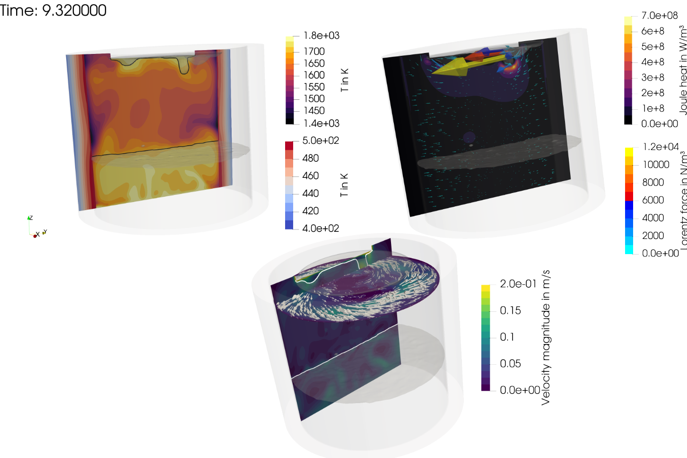

# Collection of OpenFOAM Solvers developed for the Prediction of the MHD - Multiphase Flow inside a Slag Bath of the ESR process

This is a collection of several modified OpenFOAM solvers and libraries, which was derived from the combination of many existing projects during the work on my phd thesis.
A special thanks to the developers of those and also to the people who write the endless documentation, tutorials, etc., your work makes the usage of this products possible in the first time.
The following projects were used (directly or indirectly):

- OpenFOAM openfoam.com, openfoam.org, https://sourceforge.net/projects/foam-extend/
- Elmer FEM https://github.com/ElmerCSC/elmerfem
- EOF Library https://github.com/jvencels/EOF-Library
- VoF Library https://github.com/DLR-RY/VoFLibrary
- isoAdvector https://github.com/isoAdvector/isoAdvector
- varRhoTurbVOF https://github.com/wenyuan-fan/varRhoTurbVOF

My work would not be possible with all of you!

**Thank you very much!**

## Description of the Solvers

The following "newly - combined" solvers are available in this repository:
  - compressibleInterFlowCpad
  - chtMultiRegionInterFoam
  - chtMultiRegionInterIsoFoam
  - mhdChtMultiRegionInterFoam
  - mhdChtMultiRegionInterFoamCpad
  - mhdChtMultiRegionInterIsoFoam
  - mhdChtMultiRegionInterIsoFoamCpad
  - mhdChtMultiRegionInterIsoFoamCpad_mod
  - mhdVarRhoInterFoam
  - mhdVarRhoInterFoamCpad
  - mhdVarRhoInterIsoFoam
  - mhdVarRhoInterIsoFoamCpad
  - mhdVarRhoInterIsoFoamCpad_mod
  - varRhoInterFoam
  - varRhoInterFoamCpad
  - varRhoInterIsoFoam
  - varRhoInterIsoFoamCpad

They have been developed and tested for OpenFOAM v1912, it is very likely that you need to make modifications using other OpenFOAM releases oder versions.

The following naming conventions are used together with the default solver names:

||Description|
|---|---|
|mhd|Coupling to Elmer FEM with EOF library, see "J. Vencels, P. Råback, und V. Geža, „EOF-Library: Open-source Elmer FEM and OpenFOAM coupler for electromagnetics and fluid dynamics“, SoftwareX, Bd. 9, S. 68–72, Jan. 2019, doi: 10.1016/j.softx.2019.01.007."|
|varRho|Using of alternative variable density in interface regions see "W. Fan und H. Anglart, „varRhoTurbVOF: A new set of volume of fluid solvers for turbulent isothermal multiphase flows in OpenFOAM“, Computer Physics Communications, S. 106876, Aug. 2019, doi: 10.1016/j.cpc.2019.106876."|
|interIso (interFlow)|Using alternative interface reconstruction scheme, see "J. Roenby, H. Bredmose, und H. Jasak, „A computational method for sharp interface advection“, R. Soc. open sci., Bd. 3, Nr. 11, S. 160405, Nov. 2016, doi: 10.1098/rsos.160405."|
|Cpad|Inclusion of continuos phase area detection for post processing purposes, see https://github.com/c-schubert/of-cpad-library|
|_mod|EOF Modification with cutoff value for phase fraction to electrical conductivity coupling - usefull when there are areas with very low phase fraction values, which may be caused by numerical inaccuracy in some multi phase flow cases|

Furthermore there reside some default solver in this the solver directory of this repository, which are there only for convenience to reference indirect directories in the "wmake options files". 

**Warning: I am not an OpenFOAM Programming expert and the solver have not been mathematically verified or validated! So use it on your own risk ;)**

## Compilation and Usage

Short description of setup proccedure:
  - Download this repository
  - Download and compile elmer
  - Download and compile OpenFOAM
  - **Make sure both are compiled with same MPI library**
  - modify and source `./etc/.bashrc` file
  - install eof (v1912) commsplit fix (see `./libs/commSplit_modifed_1912` - you may to have root rights for that, depending on OpenFOAM install directory location)
  - compile the needed solver (`./solver/...`) by going to the directory and running wmake (maybe you have to compile some solver dependency (i.e. other solver) bevore!)

## Examples

Example application ESR process with rotating electrode - located unter `./examples/mhdChtMultiRegionInterIsoFoam_mod`

Here you can see some example field calculated by the "mhdChtMultiRegionInterIsoFoamCpad_mod" solver for the simulation of electrode dripping behavior in a rotating electrode ESR process.

## Possible Future Enhancements (TODOs)

  * Implement recent changes in OpenFOAM v8, which introduce the possibility to use convergence criteria in different regions (by now (v2006) no convergence criteria are used in the openfoam.com chtMultiRegion... solvers)
  * Better OpenFOAM Versions support
  * Integration different surface tensions modells (see K. J. Vachaparambil und K. E. Einarsrud, „Comparison of Surface Tension Models for the Volume of Fluid Method“, Processes, Bd. 7, Nr. 8, S. 542, Aug. 2019, doi: 10.3390/pr7080542.
)
  * Updating varRhoTurbVOF (https://github.com/wenyuan-fan/varRhoTurbVOF_2)
  * faster 2D Example 

## Disclaimer

**This solver collection was developed and tested for OpenFOAM v1912** (from the openfoam.com releases). It is highly possible that it will not work using other realeses, without making some modifications. 

The Elmer FEM development (devel) branch (latest commit 521752c2a1ccc7c046e41254ad84c61939d5a7c2, 31.1.2020) was used/tested for the EOF coupled solvers. Here version changes may also introduce problems but are less likely to.

*The project in which the work on this solver was fundet is over by now, so I wont be able to make many enhancements in the near future myself. We hope there will be future projects to make more enhancements to these solver collection. Nevertheless if there may be any pull request I will try to have a look ...*

## Acknowledgment
The authors gratefully acknowledge the support of the
German Research Foundation (Deutsche Forschungsgemeinschaft – DFG) during the DFG project PF 394/24-1 (2016-2019).

## Licensing

All files (modified by me) released under GPL 3.0 (see `LICENSE` file) or under another license if these is separately mentioned in a source file.